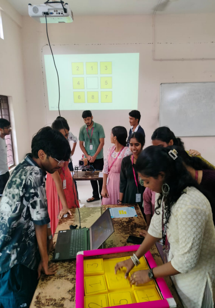

# 🧩 8-Puzzle Challenge: Human vs. AI! 🤖

  

This project features an AI solver (Best-First Search with Manhattan distance) for the classic 8-Puzzle, complete with a Tkinter GUI that visualizes the AI's solution steps in real-time.

## Overview

Experience the 8-Puzzle in a unique competitive setting! A volunteer can initiate the AI solver alongside a human's manual attempt on a physical puzzle. The graphical interface provides feedback on the AI's progress. A "Stop" button allows the volunteer to declare the human the winner if they successfully solve the puzzle before the AI algorithm completes its search.

This project demonstrates a basic AI search algorithm applied to a classic problem and offers an engaging way to compare human and machine problem-solving efficiency.

## Features 

* **AI Solver:** Implements the Best-First Search algorithm.
* **Heuristic:** Utilizes the Manhattan distance heuristic to guide the search.
* **GUI Visualization:** Uses Tkinter to visually represent the 8-Puzzle board and the AI's step-by-step solution.
* **Customizable AI Speed:** The volunteer can control the visualization speed using the `time.sleep()` function in the code.
* **Human vs. AI Challenge:** Designed for a real-world comparison where a human races against the AI.
* **Volunteer Control:** A "Start" button initiates the AI, and a "Stop" button allows declaring a human victory.

## Code Description 

* `heapq`: Used for implementing the priority queue in the Best-First Search.
* `time`: Used for introducing delays to visualize the AI's steps.
* `tkinter`: Used for creating the graphical user interface.
* `GOAL_STATE`: Defines the target configuration of the 8-Puzzle.
* `manhattan_distance(state)`: Calculates the Manhattan distance heuristic for a given puzzle state.
* `get_neighbors(state)`: Generates the possible next states from a given state by moving the blank tile (0).
* `best_first_search(start_state)`: Implements the Best-First Search algorithm to find the solution path.
* `read_start_state()`: Defines the initial configuration of the puzzle for the challenge.
* `update_gui_puzzle(state, labels)`: Updates the Tkinter GUI to display a given puzzle state.
* `solve_puzzle()`: Animates the solution path found by the AI on the GUI.
* `start_puzzle()`: Initiates the puzzle-solving animation.
* `stop_puzzle()`: Stops the animation and declares the human the winner.
* The main part of the script sets up the Tkinter window, creates the puzzle grid, and defines the start and stop buttons.

## Author

Joe Mathew
